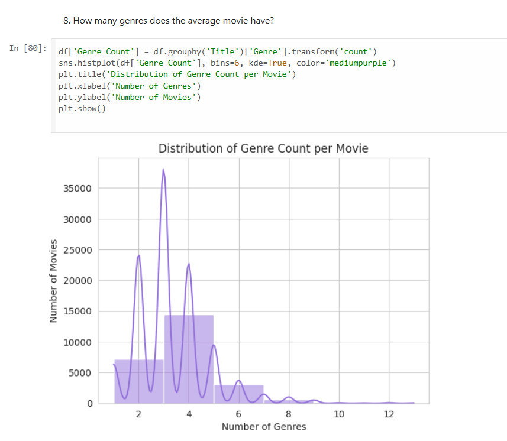

# 🎬 Movie Data Analysis Project

This project explores a dataset of over 9,000 movies to extract actionable insights around genre popularity, audience ratings, release trends, and vote behavior. The goal is to provide data-driven support for content strategy, marketing, and production decisions.

🔗 **Run in Google Colab:** [Open Notebook](https://colab.research.google.com/github/barath0704/movie-data-analysis/blob/main/movie_data_analysis.ipynb)

## 📌 Objectives

- Analyze genre distribution and diversity
- Track release trends by year and month
- Identify audience engagement through vote counts and popularity
- Explore top-performing franchises and hidden gems

## 🛠 Tools Used

- Python (Pandas, NumPy, Seaborn, Matplotlib)
- Google Colab
- Jupyter Notebook
- GitHub for version control

## 📊 Key Business Questions Answered

1. What is the most common movie genre?
2. Which genres receive the highest vote counts?
3. How do franchise movies compare to standalone ones?
4. When are most movies released?
5. Which movies are outliers in popularity or critical acclaim?
... and more than 20 total insights.

## 📁 Project Files

| File | Description |
|------|-------------|
| `movie_data_analysis.ipynb` | Full notebook with code, charts, and business insights |
| `movies_dataset.csv` | Data source |

## 🖼 Sample Visualization

## 📌 Summary

This project demonstrates the power of Python-based data analysis in drawing meaningful conclusions from raw data. It is suitable for resumes, portfolios, and internship submissions.
